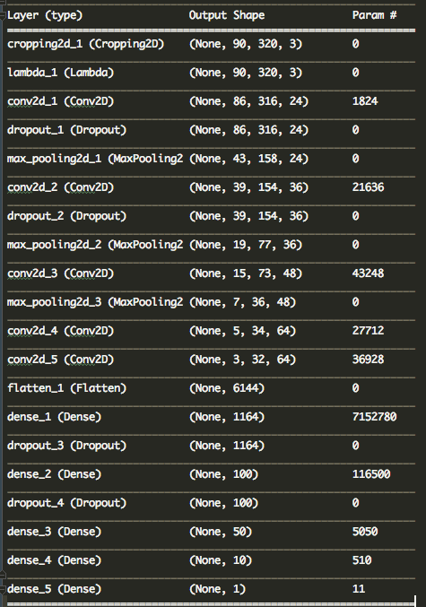

# **Behavioral Cloning** 

## Writeup Template

---

The goals / steps of this project are the following:
* Use the simulator to collect data of good driving behavior
* Build, a convolution neural network in Keras that predicts steering angles from images
* Train and validate the model with a training and validation set
* Test that the model successfully drives around track one without leaving the road
* Summarize the results with a written report


## Rubric Points
---
### Files Submitted & Code Quality

#### 1. Submission includes all required files and can be used to run the simulator in autonomous mode

My project includes the following files:
* model.py containing the script to create and train the model
* drive.py for driving the car in autonomous mode
* model.h5 containing a trained convolution neural network 
* writeup_report.md or writeup_report.pdf summarizing the results

#### 2. Submission includes functional code
Using the Udacity provided simulator and my drive.py file, the car can be driven autonomously around the track by executing 
```sh
python drive.py model.h5
```

#### 3. Submission code is usable and readable

The model.py file contains self-explanatory code for training and saving the convolution neural network. The file shows the pipeline 
I used for training and validating the model, and it contains comments to explain how the code works.

### Model Architecture and Training Strategy Overview

#### 1. An appropriate model architecture has been employed

My final model is a tweaked version of NVIDIA that consists of a convolution neural network with **3 5x5** kernels and **2 3x3** kernels sizes 
with **24, 36, 48, 64 and 64** filter depths respectively (model.py lines 62-76) 

The model includes RELU activation layers to introduce nonlinearity (code line 65, 68, 71), and the data is normalized in the model 
using a Keras lambda layer (code line 64). 

#### 2. Attempts to reduce overfitting in the model

The model contains dropout layers in order to reduce overfitting (model.py lines 66, 69, 72, 75, 77, 80, 82). 

The model was trained and validated on different data sets to ensure that the model was not overfitting.
The model was tested by running it through the simulator and ensuring that the vehicle could stay on the track.

#### 3. Model parameter tuning

The model used an adam optimizer, so the learning rate was not tuned manually (model.py line 94).

#### 4. Appropriate training data

Training data was chosen to keep the vehicle driving on the road. I used a combination of center lane driving, recovering from the left
and right sides of the road along with augmented data

For details about how I created the training data, see the next section. 

### Model Architecture and Training Strategy Details

#### 1. Solution Design Approach

The overall strategy for deriving a model architecture was:

* The first play convolution neural network model was the simple regressor, i.e., Dense(1) layer. The idea was to see how the
 drives autonomously with a severly underfitted model. As expected the car literally was on the hills going round in circles.
* In order to gauge how well the model was working, I split my image and steering angle data into a training and validation set. 
* As expected, I found that my first trivial model had a low mean squared error on both the training and validation sets. 
This implied that the model was under-fitting. 
* As a first real model, I started with LeNet model and found that training data had low MSE error while validation data
had high MSE error, which is a clear case of overfitting. The car was moving a little bit on the road before crashing into water
* Before combattting overfitting, it was important to **crop out** data that is irrelevant to reduce training time using 
```Cropping2D(cropping=((50, 20), (0, 0))``` layer and normalize the data for **0 mean** with a ```Lambda()``` layer

* To combat the overfitting, I started collecting more training data - **2 laps of middle lane driving** long with 
**horizontally flipped augmented data**. This started to perform much better - with the car autonomously driving considerable 
distance on straight road along with mild curves. However, car started to go off-track and on the mud or sometimes getting stuck 
on the shoulder boundary. This indicates, the model might still be overfitting (lack of curveed training data?)
* As a next step, I started to collect another 3/4th lap of curved and recovery data along with utilizing **left camera** and
**right camera** data(which was fed into horizontal flipping, for more data!)
* Finally, I collected one lap of counter-clockwise driving
* Surprisingly, I didnt see any considerable change in the autonomous driving. However, upon checking training and validation, it looked 
like the model may be underfitting with both the MSE errors being higher than before
* I then proceeded to implement NVIDIA model with **3 5x5** kernels and **2 3x3** kernels sizes 
with **24, 36, 48, 64 and 64** filter depths respectively, followed by 5 ```Dense()``` layers of sizes **1164, 100, 50, 10 and 1** respectively
* Unfortunately, the car's autonomous driving with this model was abysmal with the car crashing into water fairly quickly.
This was a clear case of overfitting which was corroborated by MSE errors of traning and validation data
* The final tweak that worked well was to reduce overfitting by adding ```Dropout()``` layers

#### 2. Final Model Architecture

The final model architecture (model.py lines 62-76) consisted of a convolution neural network with the following layers:



#### 3. Creation of the Training Set & Training Process

To capture good driving behavior, I first recorded two laps on track one using center lane driving. 
I then recorded the vehicle recovering from the left side and right sides of the road back to center so that the vehicle 
would learn to recover back to center of the road when off-road.

To augment the data set, I also flipped images and angles thinking that this would add more data that mimics data
from a different track or mimics more laps in opposite direction. I finished data collection with one lap of training data
in counter-clockwise direction.

By this point, the car was already on the road with an occasional stepping on the shoulder. So, I repeated this process
on track two in order to get more data points. This helped to smoothen out or generalize the model by the reducing the
frequency of the autonomous car stepping onto shoulder.

After the collection process, I had ~29000 number of data points. I then preprocessed this data by:
* Cropping out irrelevant parts of the image(50 px from top, 20 px from bottom, 0 px from sides)
* Normalizing the cropped out images to attain zero-mean

I finally randomly shuffled the data set and put 20% of the data into a validation set. Following training details were observed:

* The ideal number of epochs was 3 on most cases as evidenced by a (local?) minima of validation error after epoch number 3
* I used an adam optimizer so that manually training the learning rate wasn't necessary.

